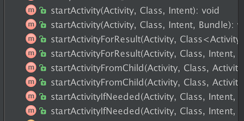

# CakeRun
Android Hook Crash 框架

###1.概述

Crash对用户体验的影响是致命的。

想象一下几个场景：

- 引用了新的框架，在Application中初始化，框架崩了，haha~开心不？你的应用连启动都做不到了，热更新强更新起不到任何作用。用户只能卸载掉你的应用重新下载。那么问题来了，若不是强需，卸载后还有多少用户会去下载？

- 一个非关键路径页面里非常小的Bug引起的奔溃。说实话这个页面的功能它根本无足轻重，但问题是就因为这个，你应用的奔溃率刷刷上涨，BOSS看着能高兴？

Bug的产生往往是不可预料，且无法绝对避免。那么如何应对这些未知的Crash呢？

一个可控的问题将不再是问题，把Crash Hook住，就是我们下面要讲的框架 ----CakeRun.

###2.Crash分类

我们将Crash分为两个部分和两个类别。

#####部分一：Application Crash

最棘手的Crash莫过于Application奔溃。这里我们的解决思路是，按照功能类别将Application中的操作拆分为一个个独立方法，当执行到某个方法程序奔溃后，我们可以定位到这个方法，重新启动程序，再次执行到该方法时跳过执行。

类似于下面这段代码：

	public class ElemeApplicationContext extends Application{
		//记录上一次执行到哪个方法
    	int nowStep = 0；

    	private void init(){
    	    initA();
    	    initB();
    	    initC();
    	}
    	private void initA(){
    	    if(nowStep!=1){
    	        nowStep = 1;
        	}else{
            	return;
        	}
        	//init~~
    	}
    	private void initB(){
        	if(nowStep!=2){
            	nowStep = 2;
        	}else{
            	return;
        	}
        	//init~~
    	}
    	private void initC(){
        	if(nowStep!=3){
            	nowStep = 3;
        	}else{
            	return;
        	}
        	//init~~
    	}
	}

#####部分二：以Activity为单位的其他Crash

部分二其实就是所有的非Application Crash。但为什么要以Activity为单位呢？当某个Activity内部产生了严重Crash（严重：非偶然奔溃，必Crash或Crash次数很多），我们可以直接屏蔽该Activity的启动。

而如果过于细化处理某个Fragment、某个View甚至某个方法的Crash，将会对代码的编写和维护产生非常严重的影响。

这里需要提一点：**Hook 住 Crash不是目的和终点，而是让问题变得可控，可解决。最终的目的是让APP跑起来，可以执行我们真正的补救措施。**

#####分类一：非关键路径Crash

什么是非关键路径Crash？就是这一块的代码不执行，对APP的影响并不是致命的。

举个例子：

- 团购APP的定位模块崩溃了，不定位也是可以继续用的嘛，手输城市也可以。

- 微信里附近的人模块奔溃了，这个功能暂不开放也是可以的嘛，不影响聊天。

那么这样的Crash，我们便不需要阻塞程序运行强制更新，可以暂时关闭该功能模块入口，交付用户继续使用，通过其他更为柔和的办法解决（热更新或非强制更新）。

#####分类二：关键路径Crash

这个Crash如果不解决，我程序根本跑步起来，或者跳过这段代码跑起来也没用，APP都失去意义啦。

举个例子：

- 送餐APP不能接单啦。

- 音乐APP不能出声音啦。

面对这样的Crash，建议直接中断程序执行，直接转到更新页面让用户强制更新或等待强制更新。

###3.Hook异步任务

这个单独拿出来讲了，因为这确实是一个很棘手的问题。我们可以先看一下异步任务的错误栈：

异步线程我是在Application中调用AptClient类中的方法start的，但是在错误栈中你看到了什么？错误栈并不能跟踪到Application中。

可能你还没有特别清楚这个问题的严重性。假设AptClient类是第三方开源库，它内部有一个异步初始化操作。当我在Application调用AptClient的init方法，init方法启动异步线程后Crash了，单纯的通过错误栈，你已经无法确定是不是在Application中奔溃的，更确定不了是在Application中哪行代码引起的。

也就是说异步任务Crash时，已经不能很简单的判断跳过Application中的哪个初始化方法了。

####问题总是要解决的

**异步任务往往是不可控的，尽量不要在Application中出现。**

但所有人都知道，异步任务是避免不要的。

这里初步的折中解决方案是，执行异步初始化之前，预估该异步初始化执行时间t和包名或全类名。在Application执行结束后，持续监控t时间。t时间内发生Crash后，首先检查Crash是否在该包名或全类名下，是，则认为是Application中该异步初始化引起的Crash，重启应用程序，跳过该初始化任务。

###4.Hook Crash框架 CakeRun的使用

前面我们讲了Crash的分类和如何定位Crash（Application中的Crash交给CakeRun定位，Activity中的Crash交给开发者定位）。

那么在定位到之后如何处理呢？在看懂CakeRun的使用后你就明白了。

####1.依赖

Install with gradle

	dependencies {
        compile 'com.github.zhaoxuan:cake-run:0.0.1'
    }

####2.实现ICrashPatch接口，设定Crash后的响应

*ICrashPatch*有三个方法：

startApplicationCrashActivity

	/**
     * Application关键路径Crash后，跳转到更新Activity来下载回退版本Apk,或等待新的更新
     */
    void startApplicationCrashActivity();
    
    /**
     * 非Application Crash后，重启APP前，给予用户的提示
     * 若弹Toast提示，可延时几秒
     * 该方法可空缺不写
     */
    void showCrashNotice();
    
    /**
     * 屏蔽某Activity启动后，给予用户的提示
     */
    void closeActivityNotice();
    
下面是示例代码：

	/**
     * Created by lizhaoxuan on 16/6/12.
     */
    public class CrashPatch implements ICrashPatch {
        private Context context;
        public CrashPatch(Context context) {
            this.context = context;
        }        
    
        @Override
        public void startApplicationCrashActivity() {
            Intent in = new Intent(context, CrashPatchActivity.class);
            in.setFlags(Intent.FLAG_ACTIVITY_NEW_TASK | Intent.FLAG_ACTIVITY_EXCLUDE_FROM_RECENTS);
            context.startActivity(in);
        }
        @Override
        public void showCrashNotice() {
            try {
                Thread.sleep(3000);
                Toast.makeText(context, "抱歉，程序奔溃，正在重新启动", Toast.LENGTH_SHORT).show();
            } catch (InterruptedException e) {
                e.printStackTrace();
            }
        }
        @Override
        public void closeActivityNotice() {
            Toast.makeText(context, "抱歉，该页面发生错误", Toast.LENGTH_SHORT).show();
        }
    }
	

####2.Application 初始化CakeRun

**限制：** CakeRun的初始化要第一个进行。（它不初始化，怎么Hook其它的呀~）

		//CakeRun需要在Application中第一个初始化
        new CakeRun.Build(this, //Application
                "0.1", //App版本号，
                new CrashPatch(this))  //Crash后响应，就是上面我们实现了ICrashPatch的类
                .setAsyncMonitorTime(1500) // 异步任务在Application结束后持续监控时间 默认1500
                .setMaxRestartNum(5) //Application Crash后，最大重启次数，默认5
                .setAlwaysRestartApp(true) //非Application Crash后 是否一直重启，默认false
                 .setResetCrashLogTime(1000*60*60*24*2); //重置Crash日志记录时间（根据App使用频率设置）。默认三天重置一次。
                .build();

		//开始执行application中被注解@AppInit 和 @AsyncInit 修饰了的初始化方法
		CakeRun.getInstance().applicationInit();

####3.使用注解

CakeRun有两个注解：@AppInit 和 @AsyncInit

- @AppInit用来修饰同步初始化方法。有两个参数

		//该初始化方法的唯一标示，不可与其他方法重复
		//所有修饰了@AppInit 和 @AsyncInit 的方法将按照tag从小到大执行。
		int tag();
		
		//该方法发送Crash后，是否可以跳过执行
		//非关键路径crash，不执行App也可以继续运行。（例如加载首页动画失效）。
		//true:可以跳过。默认false
    	boolean canSkip() default false;

- @AsyncInit 用来修饰异步初始化方法。有三个参数。

		//该初始化方法的唯一标示，不可与其他方法重复
		//所有修饰了@AppInit 和 @AsyncInit 的方法将按照tag从小到大执行。
		int tag();

		//异步初始化的Crash定位依据 第三方库的包名或本地项目的全类名
		//在异步初始化未结束之前，发生Crash，首先严重Crash是否是这些包名或类名引起的。
    	String[] packageName();

		//该方法发送Crash后，是否可以跳过执行
		//非关键路径crash，不执行App也可以继续运行。（例如加载首页动画失效）。
		//true:可以跳过。默认false
    	boolean canSkip() default false;

**这些注解只可以修饰Application中的无参方法。**

####4.Activity跳转

CakeRun接管了Activity的跳转。通过CakeRun跳转的Activity，可以命令和Crash记录控制是否屏蔽跳转。

CakeRun提供了大部分的startActivity方法：

示例代码如下：

	public class TwoActivity extends AppCompatActivity {

    	public static void startActivity(Activity activity){
        	Intent intent = new Intent(activity,TwoActivity.class);
        	/**
        	 * 通过CakeRun 提供的 startActivity 启动Activity.
        	 * 必要时可以关闭该入口
        	 */
        	CakeRun.getInstance().startActivity(activity,TwoActivity.class,intent);
    	}
    }
    
   
####5.屏蔽Activity跳转

CakeRun会记录所有的Crash信息，错误日志的分析交给开发者进行。开发者可以通过第三方Bug收集工具分析Bug信息，通过Bug分析来决定是否要关闭某些Activity。

当有需要关闭的Activity时，可以向app发送一个json字符串。CakeRun通过json，在每次跳转Activity时检查目标Activity是否已被屏蔽。

设置代码：

	CakeRun.getInstance().setCloseActivity（String json）;

建议在Apk打开的第一个页面（和Apk更新检查同步），去加载该json字符串。

字符串格式如下：

	json数组：
	[
		{
			//Crash的全类名
			"fullActivityName":"com.lizhaoxuan.demo.ThreeActivity",
			//Crash次数
			"crashNum":5,
			//目标App版本信息
			"versionName":"0.1.0"
		},
		{
			"fullActivityName":"com.lizhaoxuan.demo.ThreeActivity",
			"crashNum":5,
			"versionName":"0.1.0"
		}
	]

实例代码：

	public class MainActivity extends AppCompatActivity {
        @Override
        protected void onCreate(Bundle savedInstanceState) {
            super.onCreate(savedInstanceState);
            setContentView(R.layout.activity_main);
            CakeRun.getInstance().setCloseActivity(loadCloseActivity());
        }
        /**
         * MainActivity是应用启动后第一个执行的Activity
         * 在这个Activity中，通常我们会获取一些更新信息、在线参数等
         * 通过其他Bug收集工具，开发者可以对Bug进行分析，决定关闭哪些正在发生Crash的非关键路径
         * Activity.
         * 假设我们通过下面方法取得开发者发出的Activity关闭信息。
         * 得到一个Json字符串后交给CakeRun处理。
         * 只有符合该版本且发生目标包名下的Crash到一定次数，Activity才会被关闭。
         */
        private String loadCloseActivity() {
            return "对应的json字符串";
        }
    }

